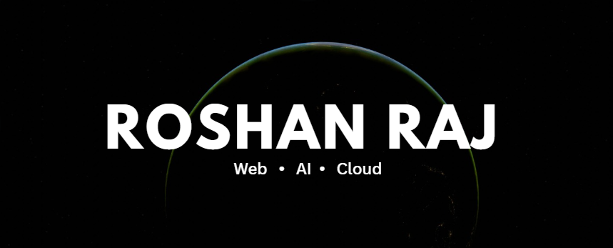

  
  <h3 align="center"> I'm a passionate developer who enjoys exploring how software, cloud systems, and AI models work behind the scenes.</h3>

  

## 💫 About Me

My interests include:
- 🌐 Full-stack **Web Development**
- ☁️ **Cloud Computing** (AWS, Azure, DevOps basics)
- 🤖 **AI & LLMs** — tokenization, attention, embeddings
- 🧠 **Computer Science Fundamentals**
- 🛠️ Clean, scalable, functional software

## 🌐 Socials

  
  
  

## 💻 Tech Stack

## 🚀 Currently Learning

  
  
  
  
  

# 📊 GitHub Stats
 
 

### 🔝 Top Contributed Repo

  

 ❤ Open to collaborations, discussions about tech, or a friendly chat about code! Thanks for visiting.❤️

